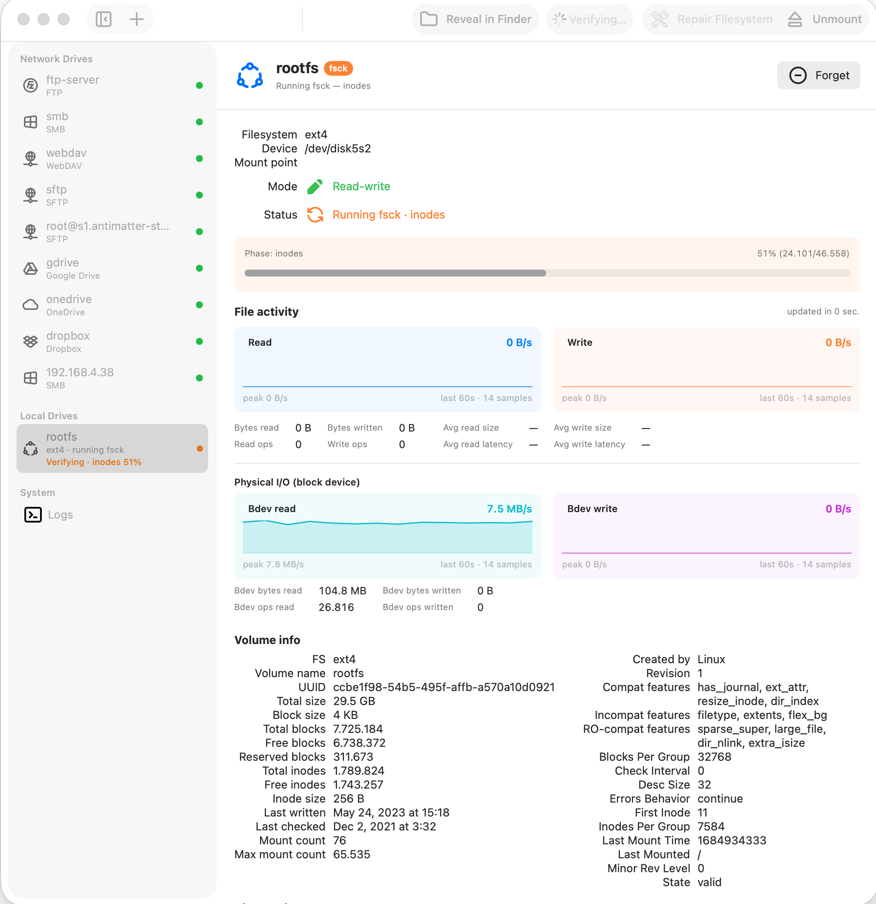

# DiskJockey



DiskJockey is a macOS application for mounting remote storage and disk images as native Finder volumes. It unifies three categories of filesystems — **network/cloud storage**, **block-device disk images**, and **local passthrough** — behind a consistent Finder experience. The block-device side is built on **FSKit** (macOS 15+) with pure-Rust filesystem drivers linked directly into per-filesystem extensions; the network side uses a **File Provider** extension backed by a Go networking library. Use it when you want ext4 / NTFS images and FTP / SFTP / SMB / WebDAV / S3 / Dropbox / Google Drive / OneDrive endpoints to look and behave like ordinary Finder volumes, without kernel extensions and without bundling third-party userspace tooling.

---

## Caveat

Because DiskJockey installs a File Provider extension and FSKit extensions, macOS requires the whole app bundle to be signed by a trusted Apple Developer identity. If you don't have an Apple Developer account, you can read the code but you can't run it end-to-end. Treat it as an educational reference in that case.

---

## Features

- **Native Finder volumes for ext2 / ext3 / ext4 disk images.** Pure-Rust driver, FSKit extension, read + write.
- **Native Finder volumes for NTFS disk images.** Pure-Rust driver, FSKit extension, mount + read + write.
- **Eight network / cloud filesystems** through a File Provider extension: FTP, SFTP, SMB, WebDAV, S3, Dropbox, Google Drive, OneDrive.
- **Local-directory passthrough** disk type for end-to-end testing of the File Provider stack.
- **Per-mount tagged logging** with live in-app log views and per-partition log strips.
- **Per-mount I/O counters and throughput sparklines for every network driver** — HTTP-based drivers (Dropbox / Google Drive / OneDrive / WebDAV / S3) wrap their `http.Client`; socket-based drivers (FTP / SFTP / SMB) wrap the underlying `net.Conn`. FTPS counts ciphertext bytes (what the wire sees, not the plaintext). One unified `MountStats` snapshot shape across all eight.
- **Provider-native thumbnails for Dropbox, Google Drive, and OneDrive** — each driver hits the provider's thumbnail endpoint directly (Dropbox `get_thumbnail_v2`, GDrive `thumbnailLink` CDN, OneDrive `/items/{id}/thumbnails`); the source file is never downloaded. Thumbnails go through a SQLite cache so Finder's repeated asks for the same icon never re-fetch.
- **Browser-based OAuth sign-in** for Dropbox, Google Drive, and OneDrive — refresh tokens stored in Keychain.
- **Automatic re-authorisation when an OAuth refresh token dies.** All three providers (Dropbox / Google Drive / OneDrive) self-recover from `invalid_grant` failures: the supervisor opens the browser, runs the consent flow, writes the new tokens, and cycles the mount — no "Sign in again" button to find.
- **Tabler icon set** wired through the sidebar and detail views; OS-flavoured glyphs for ext / NTFS attached disks.

## Supported filesystems at a glance

### Network / Cloud (via File Provider extension)

| Driver        | Auth                          | List | Read | Write | Delete | Rename |
|---------------|-------------------------------|:----:|:----:|:-----:|:------:|:------:|
| FTP           | username / password           | ✅   | ✅   | ✅    | ✅     | ✅     |
| SFTP          | password / SSH key            | ✅   | ✅   | ✅    | ✅     | ✅     |
| SMB           | username / password           | ✅   | ✅   | ✅    | ✅     | ✅     |
| WebDAV        | basic auth                    | ✅   | ✅   | ✅    | ✅     | ✅     |
| S3            | access key / secret           | ✅   | ✅   | ✅    | ✅     | ✅     |
| Dropbox       | OAuth2 (browser sign-in)      | ✅   | ✅   | ✅    | ✅     | ✅     |
| Google Drive  | OAuth2 (browser sign-in)      | ✅   | ✅   | ✅    | ✅     | ✅     |
| OneDrive      | OAuth2 PKCE (browser sign-in) | ✅   | ✅   | ✅    | ✅     | ✅     |

### Block-device disk images (via FSKit)

| Filesystem | Target            | Status |
|------------|-------------------|--------|
| ext2 / ext3 / ext4 | `DiskJockeyEXT4/` | Mount + read + write; clean unmount; fsck via callback ABI |
| NTFS               | `DiskJockeyNTFS/` | Mount + read + write; verify via `startCheck`; volumes round-trip with the canonical Windows tooling |

OAuth app-registration instructions for the cloud drivers are in [`docs/`](docs/):
- [Dropbox](docs/dropbox-registration.md)
- [Google Drive](docs/google-drive-registration.md)
- [Microsoft OneDrive](docs/microsoft-onedrive-registration.md)

---

## What works

Concrete, observable on a current build:

- **ext4 FSKit extension** mounts ext2/3/4 images as Finder volumes, lists directories, opens files, accepts writes, and reports superblock metadata (UUID, label, last-mount time, dirty flag) into the host app's detail view.
- **NTFS FSKit extension** mounts NTFS images, accepts writes, and exposes a verify (`startCheck`) flow with a confirmation dialog and read-only lock indicator. Volumes round-trip with the canonical Windows verify tooling.
- **All eight network drivers** verified end-to-end against their respective servers; writes flow through Finder for every scheme.
- **Sidebar surfaces unformatted disks** discovered via DiskArbitration, with cold-start persistence and stable identity across sessions.
- **Format actions** for raw disks route through FSKit `startFormat`, chained under a single admin auth prompt.
- **Per-mount I/O counters and sparklines** in the detail view for every one of the eight network drivers — HTTP transports counted via `CountingTransport`, socket transports via `CountingConn` at the dial layer.
- **Browser-based OAuth sign-in** for Dropbox, Google Drive, OneDrive — refresh tokens stored in Keychain.
- **Auto re-authorise on dead OAuth refresh tokens** — supervisor watches FileProvider mount errors for the `oauth_reauth_required` marker, runs the consent flow in the browser, persists the new tokens, and remounts. No manual "Sign in again" step.
- **Per-mount thumbnail cache** (SQLite) with a cellular-data gate and enumerator pre-warm.
- **Local-directory passthrough** for exercising the File Provider pipeline without a real network round trip.

## What doesn't work

Honest list of known gaps as of 2026-05-09:

- **No batch / multi-select operations** through Finder yet for network mounts; single-item flows only.
- **No write-back conflict resolution UI** for cloud drivers — last-writer-wins, no merge prompts.
- **No background sync / offline file pinning** — items are streamed on demand.
- **No installer / notarised release.** Building from source with an Apple Developer account is the only path today.
- **UI redesign** — a full SwiftUI redesign of the desktop app is on the backlog; current UI is functional but unpolished in places.
- **Linux drive icon** uses a Tabler placeholder until a permissively-licensed Tux glyph is sourced.

---

## Tested

Test surface across the project:

- **`vendor/rust-fs-ext4`** — ~444 Rust test cases across the integration suite (`tests/*.rs`), including write-path crash-safety, sequence-advance, orphan recovery, ext3 RW, journal replay, and CI validation that round-trips formatted images through the Linux-side reference validator on every push.
- **`vendor/rust-fs-ntfs`** — ~395 Rust test cases, plus a data-driven matrix runner (`tests/matrix.rs` + `test-matrix.json`) that emits one trial per scenario and shells out to the platform's canonical validator on Windows runners. Mac-side mount + write smoke is the contract that gates the matrix.
- **`vendor/go-networkfs`** — per-driver Go test suites and a Docker Compose stack (`test-server/`) with FTP / SFTP / WebDAV / SMB endpoints for end-to-end driver tests.
- **DiskJockey host app** — Swift model + extension unit tests under `DiskJockey*Tests/` (mount config, log routing, FSKit shim translation).

The two Rust libraries together publish a stable C ABI (`fs_ext4_*`, `fs_ntfs_*`) and the FSKit extensions are thin Swift shims over those entry points; the test investment is concentrated in the libraries where the format complexity lives.

## Not tested

Gaps to know about before trusting this with real data:

- **No fuzzing of the FSKit shim layer** — only the underlying Rust libraries have fuzz harnesses.
- **No automated end-to-end test** that drives the full GUI → File Provider → network driver path; integration coverage stops at the protobuf boundary on each side.
- **No CI for the macOS app bundle itself** — only the vendored Rust + Go libraries have hosted CI. Xcode builds are local-only.
- **NTFS write coverage** is comprehensive at the format layer but light on adversarial cases (concurrent multi-writer, partial-power-loss simulation beyond what the matrix scenarios cover).
- **OAuth refresh-token auto-recovery** has been exercised manually (revoke access in Google's account settings → next Finder op pops the browser → re-consent → mount returns) but not soak-tested against month-long-stale tokens or cross-provider rotation edge cases.
- **Cloud driver rate-limit handling** — no soak tests against Dropbox / Google Drive / OneDrive API throttling.

---

## Roadmap

### Mounting + lifecycle
- [ ] Auto-mount network volumes at login
- [ ] Background sync + offline pinning for cloud drivers

### Filesystem coverage
- [ ] ext3 journal coverage parity with ext4 write path
- [ ] NTFS adversarial / power-loss test scenarios in the matrix runner
- [ ] APFS read-only image support (FSKit extension)
- [ ] FAT32 / exFAT image support

### Network drivers
- [ ] Additional cloud providers (Box, pCloud, iCloud Drive)
- [ ] Conflict-resolution UI for write-back races
- [ ] Per-driver rate-limit + retry policy surfaces in the GUI

### App polish
- [ ] Full SwiftUI redesign of the desktop app
- [ ] Installer / notarised release pipeline
- [ ] Permissively-licensed Linux/Tux glyph in the sidebar
- [ ] Localisation beyond the current strings table

### Tooling
- [ ] CI for the macOS app bundle (Xcode build + extension smoke)
- [ ] `THIRD_PARTY_LICENSES.md` generated from `cargo about` + `go-licenses`

---

## Changelog

Last ten dated sections only — the full project history lives in [`CHANGELOG.md`](CHANGELOG.md). Reverse-chronological, breakthroughs highlighted.

### 2026-06-22
- **Home and About pages (v1.2.0).** The app opens on a new Home landing page — welcome header, live counts (local volumes / network drives / empty drives), a supported-filesystem showcase (ext4·rw, NTFS·rw, EROFS·ro, SquashFS·ro, qcow2/VHD/VHDX/VMDK, and the eight network/cloud schemes), and Add Disk Image / Add Network Drive quick actions. A new About page carries the project description, architecture summary, the full vendored-library version table, and licence/source links; the menu-bar About window is now a compact about box that points to it.

### 2026-05-08
- **Automatic re-authorise on dead OAuth refresh tokens.** Dropbox / Google Drive / OneDrive now self-recover from `invalid_grant` failures: the Go drivers prefix the marker `oauth_reauth_required:` on dead-refresh errors, the host-app `OAuthRefreshSupervisor` watches FileProvider `mount.error` events for it, opens the browser to the provider's consent screen, writes the new refresh token to the shared Keychain (and a fresh access token to the mount-config plist for Google Drive / OneDrive — Dropbox refreshes its access token lazily inside `golang.org/x/oauth2` and doesn't cache one in plist), and cycles the FileProvider domain so the extension respawns with fresh credentials. Per-mount dedupe stops parallel Finder ops opening multiple browser tabs.
- **In-extension verify + repair for EXT4 / NTFS, with filesystem access blocked during the pass.** macOS Disk Utility's First Aid has no path to drive repair on volumes hosted by a third-party FSKit extension, so the host app drives it: it drops a `RepairRequest` JSON into the shared App Group container, the FSKit extension's directory watcher claims it, and the Rust driver's `audit_with_repair` runs directly against the live mount. A per-volume `OperationLock` (cooperative tri-state mutex: `idle` / `verify` / `repair`) blocks normal filesystem ops for the duration of the pass, since the driver is writing to the same blocks the FSKit shim is serving and they cannot both run. Earlier sketch using a `MachServices`-registered XPC service was abandoned — ExtensionKit appex bundles silently ignore those declarations — and an explicit `O_EXCL` / `fcntl` preemptive lock is forbidden by the MAS sandbox over user-mounted volumes.
- **Removed the `DiskJockeyMountHelper` privileged daemon target.** Another experiment that didn't survive contact with macOS's distribution model: SMAppService daemons require `/Applications` install and a notarised installer pipeline the project deliberately stepped off. Admin-auth flows now go through `osascript -e "do shell script ... with administrator privileges"` at the call sites that need them.
- Consolidated per-extension I/O-stats collectors into `DiskJockeyLibrary` — single shared `MountStats` shape across extensions.
- EXT4 attribute-mask + item-cache tests added on the Rust side.
- Docs: snapshots of disk-image formats, FSKit mount architecture, IP audit, NTFS baseline, public roadmap.
- Submodule bumps: `rust-fs-ntfs` → `0ac1d6f` (merged main); six new vendor crates added.

### 2026-05-03
- **I/O stats on every network driver.** FTP / SFTP / SMB now instrument the underlying `net.Conn` at dial time (FTPS counts ciphertext bytes, what the wire actually carries). WebDAV + S3 wrap their `http.Client` with the existing `CountingTransport`. Every driver implements `StatsProvider`; `networkfs_get_stats(mount_id)` returns real numbers across the board instead of zeros for five of eight drivers.
- **Native thumbnails for Google Drive and OneDrive.** GDrive uses the file metadata's `thumbnailLink` CDN URL with `=s<px>` size-rewriting; OneDrive uses `GET /items/{id}/thumbnails` to pick the right pre-rendered bucket. Neither downloads the source file. FTP / SFTP / SMB / WebDAV / S3 stay truthful (no native thumbnail API → no `Thumbnailer` impl → driver returns rc=2 → Finder falls back to a generic icon).
- Submodule bumps for rust-fs-ntfs (verbose mode wired through to remote, observability + safety contracts, bench harness + OOM fix, Tier 3 fixture dispatcher, CLI consolidation + release infra).
- Submodule bumps for rust-fs-ext4 (close all crash-safety test gaps, cross-validator infra, **ext3 RW unlock — Phase B complete**, write path Phases 1/2/3/5/6/7/8).

### 2026-05-02
- **NTFS mount breakthrough** — rust-fs-ntfs volumes mount and accept writes round-tripped with Windows tooling, after switching the test contract from validator-clean to mount + write smoke.

### 2026-05-01
- Stats: pull transport byte counts from the network library each tick; decay live throughput when no fresh sample arrives.
- Mount: chain `mkdir` + mount under one admin auth prompt; banner File Provider connection / op errors.
- Disks: skip whole-disk preview rows so Forget sticks; offline-row Mount via DiskArbitration.
- Thumbnails: SQLite cache, cellular gate, enumerator pre-warm; per-mount `MountPolicy` with thumbnail toggles.
- **FileProvider: write support across all eight schemes.**
- **OAuth: browser sign-in for Dropbox, Google Drive, OneDrive.**
- UI: two-column Volume info layout; brand glyphs for FTP / SMB / Dropbox / Google Drive; sidebar-toggle in titlebar; tabler-icons vendored.
- Format: switch from `newfs_fskit` to `diskutil eraseDisk/eraseVolume`; wire Format buttons to FSKit `startFormat`.
- Disks: `RawDisksModel` + Unformatted Disks sidebar + format scaffolding; persist disk history to JSON in App Group.
- FSKit: pure `runFsck()` with shared `FsckReport` shape; full RW write path + AppleDouble swallow; explicit verify via `startCheck`.
- Stats: per-mount I/O counters + sparkline UI.
- Logging: scope tags + per-view denylists.
- Docs: IP & licence audit landed.

### 2026-04-22
- Release 1.0.1 — vendor refresh + extension version alignment.
- UI: OS-flavoured icons for ext\* / ntfs\* attached disks.

### 2026-04-21
- UI: rename "Attached Disks" → "Local Drives", add Unmount button.
- `dev.sh`: doctor subcommand, clean-stale-bundles, reset-daemons, pluginkit-reload.
- FileProvider: classified `networkfs_mount` errors surfaced to UI; stop double-prefixing Finder sidebar name with "DiskJockey".
- UI: human-readable total / free size for every attached partition.

### 2026-04-20
- **Direct-link architecture** — removed standalone backend daemon + XPC bridge in favour of linking the network library directly into the FileProvider extension via cgo.
- Cloud-provider OAuth registration guides.
- Sandbox + symlinks: user-picked folder via `NSOpenPanel` bookmark; first-run Network Drives setup pane.
- FileProvider: direct-linked FTP driver end-to-end; mount/unmount toggle + live status; classified metadata failures.
- Logging + sidebar: route through `AppLog`, status dot, unstick "Loading"; per-mount `TaggedLogger` end-to-end; newest-first log ordering.
- Modernised `Makefile`; renamed `NFS_*` → `NETWORKFS_*`; strip symbols + DWARF (-55% on-disk).

### 2026-04-19
- About dialog shows vendored library versions; app build time + upstream commit dates.
- Refactor: move compiled vendor output to `lib/`; wire submodules into the `lib/` model.
- Attach NTFS image menu + parameterise mount `fsType`.
- `feat(fsck)`: dirty-detect + auto-fsck on mount with live UI status.
- `rust-fs-ext4` bumped to `v0.1.0`.

### 2026-04-18
- **Vendor `rust-fs-ext4` as submodule.** End of the in-tree EXT4 source phase.
- Register `DiskJockeyEXT4` FSKit extension target; add Swift sources for FSKit ext4 mounts.
- App: Attach ext4 image menu item + `FSKitMountService`; Detach volume… menu item + FSKit detach path.
- Route `/sbin/mount` + `/sbin/umount` through admin auth prompt.
- Migrate Swift bridge to `fs_ext4_*` C ABI; build system rewritten for the new layout.

---

## Architecture

DiskJockey is a host SwiftUI app plus three macOS extensions. Each extension owns one trust / lifecycle boundary; the host app is optional at runtime once a mount is configured. There is **no** Go backend daemon, **no** central XPC bridge, and **no** privileged helper — all three were tried, none survived contact with macOS's extension model, and the current shape is "host app talks to its own extensions through Apple framework APIs, period."

```
                  ┌──────────────────────────┐
                  │      DiskJockey.app      │   SwiftUI host: configure
                  │       (host app)         │   mounts, surface logs,
                  └─────┬──────┬──────┬──────┘   drive OAuth + verify/
                        │      │      │           repair UI.
              FSKit / NSFileProvider framework APIs only
                        │      │      │
                        ▼      ▼      ▼
   ┌────────────────┐ ┌───────────────┐ ┌──────────────────────┐
   │ DiskJockeyEXT4 │ │ DiskJockeyNTFS│ │ DiskJockey           │
   │ (FSKit appex)  │ │ (FSKit appex) │ │ FileProvider         │
   │ links fs_ext4 +│ │ links fs_ntfs │ │ (NSFileProvider      │
   │ img-* + parts  │ │ + img-* +     │ │  appex)              │
   │ XCFrameworks   │ │ partitions    │ │ links libnetworkfs.a │
   │                │ │ XCFrameworks  │ │ via cgo + per-driver │
   │                │ │               │ │ static libs          │
   └────────┬───────┘ └───────┬───────┘ └──────────────────────┘
            │                 │
            └────────┬────────┘
                     ▼
        ┌───────────────────────────────────┐
        │ group.com.antimatterstudios.disk- │
        │ jockey  (shared App Group)        │
        │ • verify / repair request +       │
        │   response JSON                   │
        │ • cross-process state, log files  │
        └───────────────────────────────────┘
```

### Components

- **DiskJockeyApplication** — SwiftUI macOS host. Configures mounts, hosts the OAuth coordinator + refresh supervisor, surfaces logs, drives the verify/repair UI, persists disk history. Talks to FSKit and File Provider extensions via Apple framework APIs only.
- **DiskJockeyFileProvider** — File Provider extension. Statically links the Go network library (`libnetworkfs.a`) via cgo plus per-driver static libs (`libftp.a`, `libsftp.a`, `libsmb.a`, `libwebdav.a`, `libs3.a`, `libdropbox.a`, `libgdrive.a`, `libonedrive.a`); dispatches by driver type at the protobuf boundary.
- **DiskJockeyEXT4 / DiskJockeyNTFS** — FSKit extensions (macOS 15+). Each links a Rust filesystem driver (`fs_ext4.xcframework` / `fs_ntfs.xcframework`) plus the disk-image and partition crates as XCFrameworks through bridging headers, and serves block-device reads + writes directly. No daemon mediation.
- **DiskJockeyLibrary** — Swift framework shared by the host app and every extension. Holds generated protobuf types, mount-config value types, keychain helpers, the `MountStats` shape, scoped logging, and the verify/repair protocol (`OperationLock`, `RepairRequest`, `RepairResult`).
- **`OAuthRefreshSupervisor` (host app)** — watches FileProvider `mount.error` events for the `oauth_reauth_required:` marker the Go drivers prefix on dead-refresh failures; opens the browser to the provider's consent screen, persists fresh tokens to Keychain (and through the mount-config plist for Google Drive / OneDrive), then cycles the FileProvider domain so the extension respawns. Per-mount dedupe stops parallel Finder ops opening multiple browser tabs.

### Verify + repair: in-extension, by toggling the drive's mode

macOS Disk Utility's First Aid has no entry point for driving repair on volumes hosted by a third-party FSKit extension, so DiskJockey hosts its own UI for it. The mechanism is conceptually simple: every mounted volume sits in one of three modes — **online** (the default — normal Finder operations flow through), **verify** (a read-only audit pass is in progress), or **repair** (the driver is scanning the on-disk data structures and fixing them directly). When the volume is in `verify` or `repair`, the FSKit shim **refuses to process file requests** for that volume; nothing else upstairs can race with what the driver is doing on disk.

End-to-end:

1. The host app drops a `RepairRequest` JSON file into the shared App Group container under `Repair/<fsType>/requests/`.
2. The matching FSKit extension watches that directory (the file is `RepairXPCService.swift` — legacy filename; despite the name it is not an NSXPC service) and claims new requests by atomic rename into `processing/`.
3. The extension toggles the volume into `repair` mode via a per-volume `OperationLock` (cooperative tri-state mutex). Any FS request that arrives while the lock is held is rejected.
4. The Rust driver's `audit_with_repair` walks the on-disk metadata and writes the fixes in place. Progress events stream out through the existing NDJSON log file; the host's `LogTailService` pipes them into the per-disk progress UI.
5. When the pass finishes, the lock returns the volume to `online`. The result lands as JSON under `Repair/<fsType>/responses/` and the host's watcher updates the UI.

Why files instead of XPC for the request handoff: ExtensionKit appex bundles silently ignore Info.plist `MachServices` declarations, so a real mach-service inside an extension is not on the table. Anonymous `NSXPCListener` + endpoint serialization works but is unconventional enough to court reviewer friction at App Store submission. Two of our own bundles communicating through their shared App Group container is the textbook use of App Groups — uncontroversial and MAS-defensible.

### What was tried and removed

- **Go backend daemon mediated by an XPC bridge LaunchAgent** (mach service `com.antimatterstudios.diskjockey.xpc-bridge`). Cross-bundle XPC discovery on macOS turned into a constant fight; "host app talks directly to its own extensions through the framework APIs that already exist" was simpler and more reliable. The Go drivers themselves survived — they're statically linked into the FileProvider extension via cgo.
- **`DiskJockeyMountHelper` privileged daemon target** (SMAppService). Required an `/Applications`-installed app + notarised installer pipeline, both of which sit off the Mac App Store path. Per-action `osascript -e "do shell script ... with administrator privileges"` is the sanctioned escape hatch for the few flows that genuinely need admin rights (`/sbin/mount`, `/sbin/umount`, raw-disk format).
- **`diskjockey-cli` (`djctl`)**. Existed only to exercise the Go backend's protobuf API. Removed when the backend was.
- **`MachServices`-registered XPC for verify/repair coordination.** ExtensionKit ignores those declarations from inside an extension. Replaced by the App Group file-watcher described above.

### Why a separate FSKit path for ext4 / NTFS?

Block-device filesystems don't benefit from a server-in-the-middle: all bytes come from a local file or local block device. Sending those bytes across a socket to a separate process and back is pure overhead. FSKit is Apple's sanctioned way to implement a filesystem in user space and link native parsing code directly. The Rust libraries do the format work; the Swift FSKit target is a thin shim over `FSVolume` / `FSItem`.

---

## Project layout

```
.
├── DiskJockey.xcodeproj/
├── DiskJockeyApplication/        # SwiftUI host app
├── DiskJockeyFileProvider/       # File Provider extension (network mounts)
├── DiskJockeyEXT4/               # FSKit extension for ext2/3/4 images
├── DiskJockeyNTFS/               # FSKit extension for NTFS
├── DiskJockeyLibrary/            # Shared Swift framework
│   ├── Models/
│   ├── NetworkFS/                # Per-driver MountConfig structs + keychain
│   ├── FileProvider/             # FileProvider XPC protocol + repair types
│   └── Protobuf/                 # .proto sources + generated Swift
├── docs/                         # End-user + developer docs
├── scripts/                      # Build helpers
├── lib/                          # Pre-built vendored artefacts
│   ├── fs_ext4/                  # fs_ext4.xcframework
│   ├── fs_ntfs/                  # fs_ntfs.xcframework
│   └── go-networkfs/             # libnetworkfs.a + per-driver static libs
└── vendor/                       # git submodules — source of truth for lib/
    ├── rust-fs-core/             # shared block-device traits / adapters
    ├── rust-fs-ext4/             # ext2/3/4 driver
    ├── rust-fs-ntfs/             # NTFS driver
    ├── rust-img-qcow2/           # QCOW2 reader
    ├── rust-img-vhd/             # VHD reader
    ├── rust-img-vhdx/            # VHDX reader
    ├── rust-img-vmdk/            # VMDK reader
    ├── rust-partitions/          # MBR / GPT partition probe
    ├── go-networkfs/             # Go network drivers (FTP/SFTP/SMB/WebDAV/cloud)
    └── tabler-icons/             # icon source for sync-tabler-icons.rb
```

---

## License

MIT — see [`LICENSE`](LICENSE). Copyright (c) 2025 Christopher Thomas.

For a full audit of every dependency licence and the verdict that the MIT licence is not at risk of being forced into a stricter copyleft licence, see [`docs/intellectual-property-review.md`](docs/intellectual-property-review.md).

Vendored submodules — all permissively licensed, see [`docs/intellectual-property-review.md`](docs/intellectual-property-review.md) for the per-crate verdict:

- `rust-fs-core`, `rust-fs-ext4`, `rust-fs-ntfs` (filesystem drivers)
- `rust-img-qcow2`, `rust-img-vhd`, `rust-img-vhdx`, `rust-img-vmdk` (disk-image readers)
- `rust-partitions` (MBR / GPT probe)
- `go-networkfs` (Go network FS drivers — MIT)
- `tabler-icons` (MIT — Paweł Kuna)

---

## Build

### Prerequisites

- **macOS 15 (Sequoia) or later** — FSKit requires it
- **Xcode 16+**
- **Go 1.25+**
- **Rust toolchain** (current stable; the Rust crates pin via `rust-toolchain.toml`)
- **`protoc`** with `protoc-gen-go` and `protoc-gen-swift`
- **Apple Developer account** (for code signing — required to run the File Provider and FSKit extensions)
- Optional: **Docker** for the network-driver test stack under `vendor/go-networkfs/test-server/`

### One-time setup

```bash
git clone https://github.com/antimatter-studios/diskjockey.git
cd diskjockey
git submodule update --init --recursive
```

### Build the vendored libraries

```bash
make vendor-all
```

This runs:

1. `vendor-fs-ext4` — builds the Rust ext4 library into an XCFramework at `lib/fs_ext4/`.
2. `vendor-fs-ntfs` — same for NTFS, into `lib/fs_ntfs/`.
3. `vendor-gonetworkfs` — builds per-driver Go static libs (`libftp.a`, `libsftp.a`, …) plus the combined `libnetworkfs.a` dispatcher into `lib/go-networkfs/`.

Then regenerate protobuf bindings (one-shot, regenerate after `.proto` changes):

```bash
make proto
```

`make all` chains `vendor-all` + `proto`.

### Build the app + extensions

```bash
xcodebuild -scheme DiskJockey -allowProvisioningUpdates build
```

A Run Script phase invokes `bash -lc "which go"` and rebuilds the network library on each Xcode build. **User Script Sandboxing must be off** for the target — the script needs Keychain access during signing.

### Test stack for network drivers

```bash
cd vendor/go-networkfs/test-server
docker compose up
# SFTP   → localhost:2223
# FTP    → localhost:2121
# WebDAV → localhost:8080
# SMB    → localhost:4450
```

### Vendor pin discipline

After bumping any submodule, regenerate the human-readable pin manifest:

```bash
make pins
```

`VENDOR_PINS.txt` is committed alongside the submodule bump. `make pins-check` fails if it's stale — wire into CI when CI exists for this repo.
