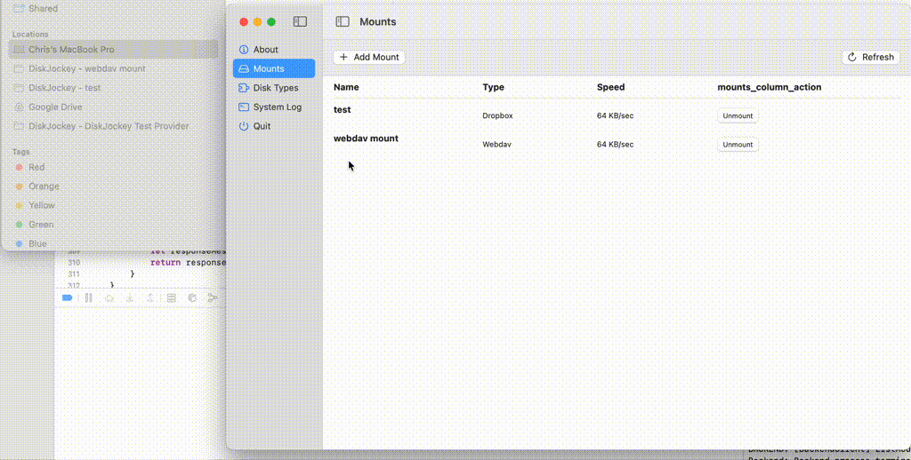
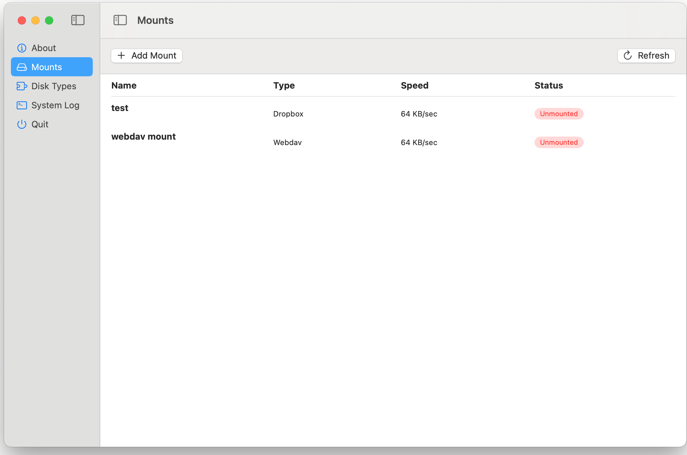
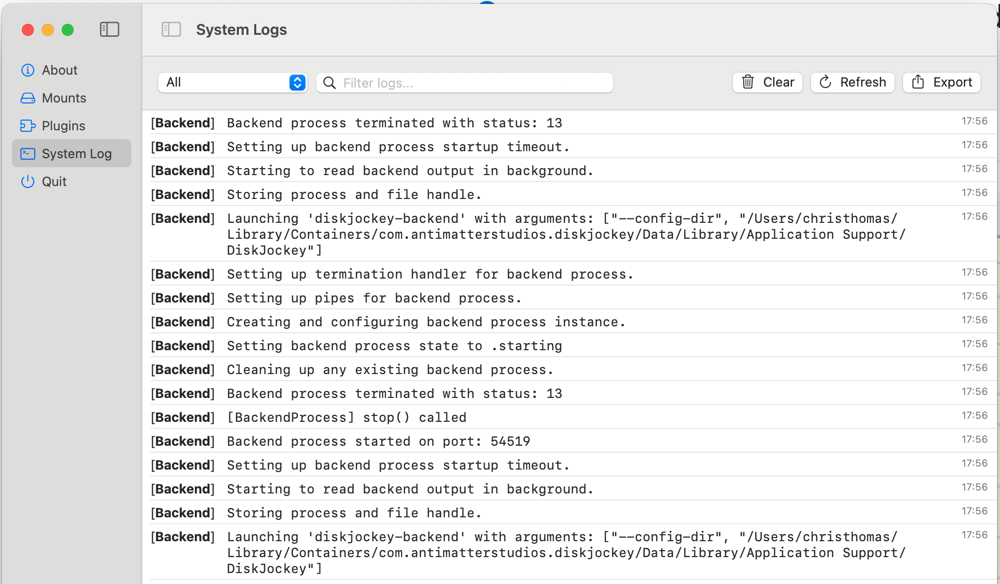
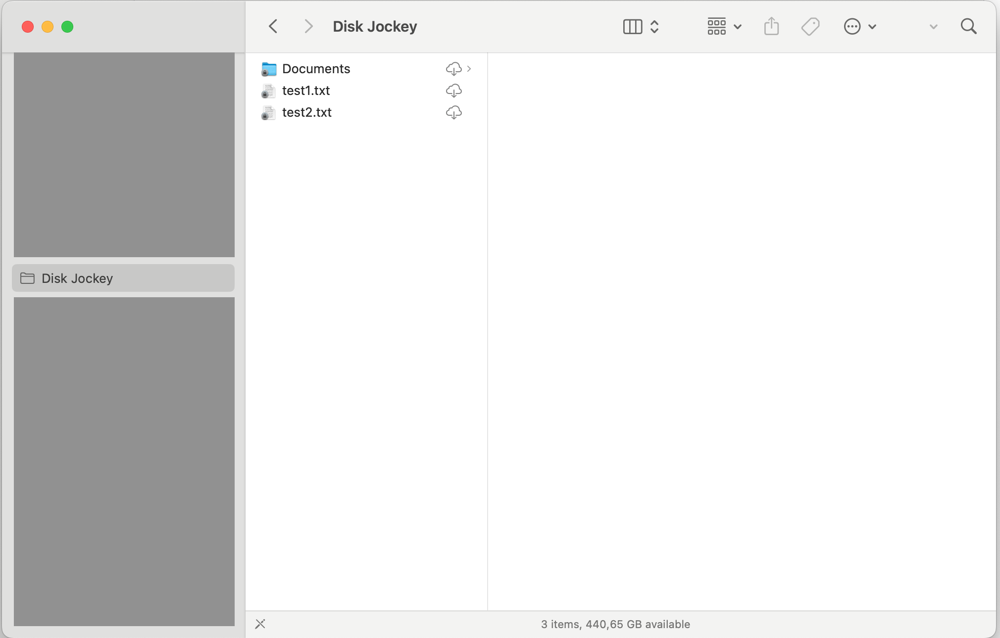
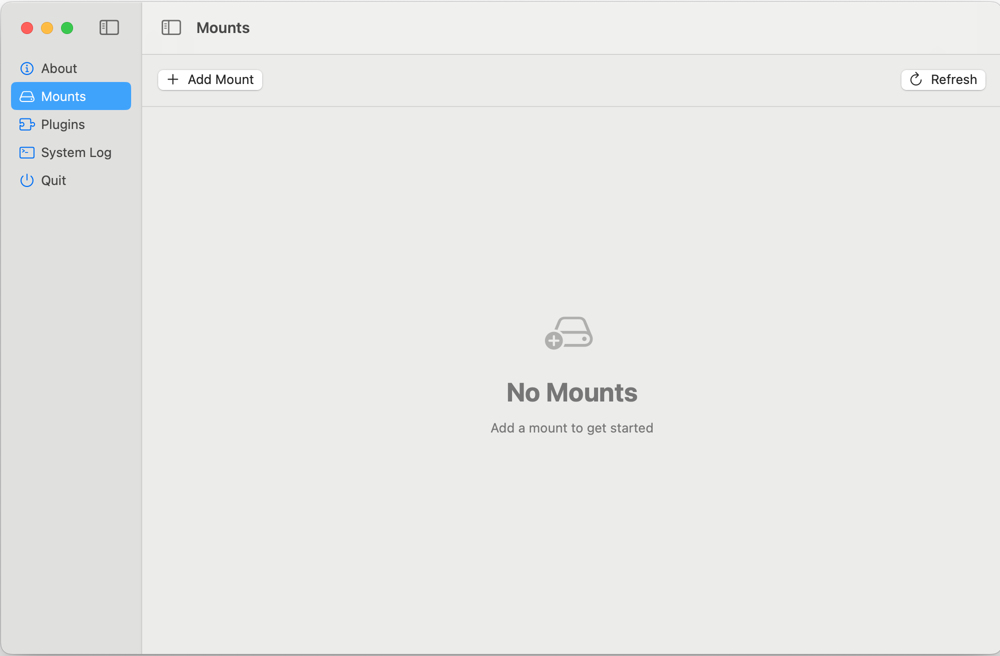

# DiskJockey


DiskJockey is a macOS application for mounting remote storage and disk images as native Finder volumes. It unifies three categories of filesystems — **network/cloud storage**, **block-device disk images**, and **local passthrough** — behind a consistent Finder experience, with a Go backend for protocol work, Rust libraries for block-device parsing, and a Swift/SwiftUI front-end.

---

## Caveat

Because DiskJockey installs a File Provider extension and FSKit extensions, macOS requires the whole app bundle to be signed by a trusted Apple Developer identity. If you don't have an Apple Developer account, you can read the code but you can't run it end-to-end. Treat it as an educational reference in that case.

---

## Supported Filesystems

### Network / Cloud (via File Provider extension)

All network drivers live in the vendored `go-networkfs` library and share a common `Driver` interface. Mounts are persisted per user and surface as Finder volumes through the File Provider extension.

| Driver        | Auth                          | List | Read | Write | Delete | Rename |
|---------------|-------------------------------|:----:|:----:|:-----:|:------:|:------:|
| FTP           | username / password           | ✅   | ✅   | ✅    | ✅     | ✅     |
| SFTP          | password / SSH key            | ✅   | ✅   | ✅    | ✅     | ✅     |
| SMB           | username / password           | ✅   | ✅   | ✅    | ✅     | ✅     |
| WebDAV        | basic auth                    | ✅   | ✅   | ✅    | ✅     | ✅     |
| S3            | access key / secret           | ✅   | ✅   | ✅    | ✅     | ✅     |
| Dropbox       | OAuth2 (long-lived token)     | ✅   | ✅   | ✅    | ✅     | ✅     |
| Google Drive  | OAuth2 refresh token          | ✅   | ✅   | ✅    | ✅     | ✅     |
| OneDrive      | OAuth2 refresh token (PKCE)   | ✅   | ✅   | ✅    | ✅     | ✅     |

OAuth app-registration instructions for the cloud drivers are in [docs/](docs/):
- [Dropbox](docs/dropbox-registration.md)
- [Google Drive](docs/google-drive-registration.md)
- [Microsoft OneDrive](docs/microsoft-onedrive-registration.md)

### Block-device disk images (via FSKit)

These mount a disk image (or partition) and expose its contents read-only through Finder via native FSKit extensions. The parsers are Rust libraries linked as XCFrameworks into the Swift extension targets.

| Filesystem | Target            | Status |
|------------|-------------------|--------|
| ext2/3/4   | `DiskJockeyEXT4/` | Probe + read-only traversal working against standard ext4 images |
| NTFS       | `DiskJockeyNTFS/` | In development |

### Local passthrough

A "local directory" disk type exists mostly as a test dummy — it mounts a chosen directory under the File Provider so the full Finder pipeline can be exercised without a real network round trip.

---

## Architecture

DiskJockey is deliberately multi-process. Each process has one job, and the process boundaries are the trust / lifecycle boundaries.

```
                        ┌────────────────────┐
                        │  DiskJockey.app    │    SwiftUI config UI.
                        │  (GUI, optional)   │    NOT required at runtime.
                        └──────────┬─────────┘
                                   │ XPC
                                   ▼
  ┌─────────────────────┐    ┌──────────────────────┐    ┌────────────────────┐
  │  File Provider Ext  │◄──►│   XPC Bridge         │◄──►│  Go backend        │
  │  (per-network-mount)│XPC │   (LaunchAgent,      │TCP │  (disktypes, state,│
  │                     │    │    mach service)     │    │   sqlite, mounts)  │
  └─────────────────────┘    └──────────────────────┘    └────────────────────┘
                                       ▲
                                       │ XPC
                             ┌─────────┴──────────┐
                             │  djctl CLI         │
                             │  (scripting)       │
                             └────────────────────┘

  ┌────────────────────────┐    ┌────────────────────────┐
  │  DiskJockeyEXT4  (FSKit)│    │  DiskJockeyNTFS (FSKit) │
  │  links libfs_ext4.a    │    │  links libfs_ntfs.a    │
  └────────────────────────┘    └────────────────────────┘
         (independent of the backend — direct block-device access)
```

### Components

- **DiskJockeyApplication** — SwiftUI macOS GUI for configuring mounts. Optional at runtime: once a mount is configured and the backend is running, the File Provider keeps working whether or not the GUI app is open.

- **DiskJockeyXPC** — A small executable installed as a **LaunchAgent** with a mach service (`com.antimatterstudios.diskjockey.xpc-bridge`). It is the central IPC hub. Every other Swift component (GUI app, File Provider extension, CLI helpers) connects to it as an XPC client; it fans requests out to the Go backend over TCP. This design exists because macOS XPC has significant restrictions on cross-bundle service discovery — a LaunchAgent with a registered mach service is the only reliable path.

- **Go backend (`diskjockey-backend`)** — Independent long-running process that owns the mount list, sqlite config store, network driver lifecycle, and any streaming data. Speaks protobuf (see [`diskjockey-backend/proto/backend.proto`](diskjockey-backend/proto/backend.proto)) over TCP. The backend is the only component that knows how to talk to FTP/SFTP/SMB/WebDAV/S3/Dropbox/GDrive/OneDrive servers — that logic all lives in the vendored `go-networkfs` library.

- **DiskJockeyFileProvider** — macOS File Provider extension that presents mounted network filesystems in Finder. It is stateless: every `enumerateItems` / `fetchContents` request goes through XPC → backend. The GUI app is not involved in the data path.

- **DiskJockeyLibrary** — Swift framework shared by the app, extension, XPC bridge, and CLI. Holds the generated protobuf code, mount-config value types, keychain helpers, logging, and the File Provider XPC protocol definition.

- **DiskJockeyEXT4 / DiskJockeyNTFS** — FSKit extensions (macOS 15+). These don't use the Go backend at all. They link a Rust library (`libfs_ext4.a` or `libfs_ntfs.a`) as an XCFramework through a bridging header and serve block-device reads directly. This is a separate path from the network-filesystem stack.

- **diskjockey-cli (`djctl`)** — Command-line client for the same protobuf API the GUI uses. Useful for scripting, headless debugging, and test automation.

### Why a LaunchAgent XPC bridge?

When this project started, the desktop app mediated all IPC. That broke as soon as the app was closed: the File Provider extension couldn't talk to a dead GUI, and re-launching the GUI from an extension is not allowed. Running the bridge as a LaunchAgent with a system-registered mach service means:

- The bridge is alive independent of the GUI.
- Both the GUI and the File Provider extension connect to the *same* bridge.
- Lifecycle is governed by `launchd`, not by the app's run state.
- The Go backend (which has its own launch constraints — see below) runs under its own LaunchAgent, and the bridge just connects to it over TCP.

### Why a separate FSKit path for ext4/NTFS?

Block-device filesystems don't benefit from a server-in-the-middle: all reads come from a local file (the disk image) or a local block device. Sending those bytes across a TCP socket to a Go process and back would be pure overhead. FSKit is Apple's sanctioned way to implement a filesystem in user space and link native parsing code directly. The Rust libraries (`rust-fs-ext4`, `rust-fs-ntfs`) do the actual work; the Swift FSKit target is a thin shim that implements `FSVolume` / `FSItem` over them.

---

## Project Layout

```
.
├── DiskJockey.xcodeproj/         # Xcode workspace with all Swift targets
│
├── DiskJockeyApplication/        # SwiftUI GUI app
│   ├── App/, Views/, Components/, ViewModels/
│   └── Repositories/             # mount store, backend connection repo, etc.
│
├── DiskJockeyFileProvider/       # File Provider extension (network mounts)
│   ├── FileProviderExtension.swift
│   ├── FileProviderEnumerator.swift
│   ├── FileProviderItem.swift
│   ├── FileProviderXPCClient.swift     # talks to the XPC bridge
│   ├── FileProviderDirectClient.swift  # fallback direct-to-backend path
│   └── NetworkFSDriver.swift
│
├── DiskJockeyXPC/                # LaunchAgent XPC bridge
│   ├── DiskJockeyXPC.swift       # mach-service listener
│   ├── BackendTCPClient.swift    # TCP client to Go backend
│   └── main.swift
│
├── DiskJockeyEXT4/               # FSKit extension for ext2/3/4 images
│   ├── EXT4FileSystem.swift, EXT4Volume.swift, EXT4Item.swift
│   ├── EXT4Backend.swift         # calls into libfs_ext4.a
│   └── DiskJockeyEXT4-Bridging-Header.h
│
├── DiskJockeyNTFS/               # FSKit extension for NTFS
│
├── DiskJockeyLibrary/            # Shared Swift framework
│   ├── Models/                   # Mount, DiskType, etc.
│   ├── NetworkFS/                # Per-driver mount config structs + keychain
│   │   ├── FTPMountConfig.swift, SFTPMountConfig.swift, SMBMountConfig.swift
│   │   ├── WebDAVMountConfig.swift, S3MountConfig.swift
│   │   ├── DropboxMountConfig.swift, GDriveMountConfig.swift
│   │   ├── OneDriveMountConfig.swift
│   │   ├── MountConfigStore.swift, MountKeychain.swift
│   │   └── NetworkFSPersonality.swift
│   ├── FileProvider/             # XPC protocol definitions
│   ├── Protobuf/                 # .proto sources + generated Swift
│   └── Network/                  # shared networking helpers
│
├── diskjockey-backend/           # Go backend daemon
│   ├── main.go
│   ├── ipc/                      # protobuf server, connection handling
│   ├── disktypes/                # per-driver adapters (thin wrappers around vendor/go-networkfs)
│   │   ├── ftp.go, sftp.go, smb.go, webdav.go
│   │   ├── dropbox.go, local_directory.go
│   ├── services/                 # config_service, sqlite_service, disktype_service
│   ├── models/                   # Mount, DiskType, Config
│   ├── migrations/               # sqlite schema migrations
│   ├── proto/                    # backend.proto + generated .pb.go
│   ├── cmd/gofs/                 # auxiliary entrypoint
│   ├── test-server/              # Docker compose with FTP/SFTP/WebDAV/SMB for testing
│   └── docker-compose.yml
│
├── diskjockey-cli/               # `djctl` CLI client
│   └── main.go
│
├── docs/                         # End-user and developer docs
│   ├── dropbox-registration.md
│   ├── google-drive-registration.md
│   ├── microsoft-onedrive-registration.md
│   ├── ext4-mount-runbook.md
│   └── p8-end-to-end-mount-plan.md
│
├── scripts/                      # Build helpers
│   ├── build-fs-ext4.sh          # builds libfs_ext4.a → lib/fs_ext4/*.xcframework
│   ├── build-fs-ntfs.sh          # same for NTFS
│   ├── build-gonetworkfs.sh      # builds the go-networkfs library
│   ├── build-godrivers.sh        # builds per-driver Go CLIs
│   └── setup-submodules.sh
│
├── lib/                          # Pre-built vendored artifacts
│   ├── fs_ext4/                  # fs_ext4.xcframework (from rust-fs-ext4)
│   ├── fs_ntfs/                  # fs_ntfs.xcframework (from rust-fs-ntfs)
│   └── go-networkfs/             # libgonetworkfs.a (from vendor/go-networkfs)
│
└── vendor/                       # git submodules — source of truth for lib/
    ├── rust-fs-ext4/
    ├── rust-fs-ntfs/
    └── go-networkfs/             # the 8-driver network filesystem library
```

---

## Building

### Prerequisites

- macOS 15 (Sequoia) or later — FSKit requires it
- Xcode 16+
- Go 1.25+
- Rust toolchain (for the ext4 / NTFS libraries)
- `protoc` with `protoc-gen-go` and `protoc-gen-swift`
- Apple Developer account (for code signing — required to run the File Provider and FSKit extensions)

### One-time setup

```bash
git clone https://github.com/christhomas/diskjockey.git
cd diskjockey
git submodule update --init --recursive
```

### Build everything

```bash
make all
```

This runs, in order:

1. `vendor-fs-ext4` — builds the Rust ext4 library into an XCFramework at `lib/fs_ext4/`.
2. `vendor-fs-ntfs` — same for NTFS.
3. `proto` — regenerates `.pb.go` and `.pb.swift` from the `.proto` sources.
4. `djb` — builds the Go backend binary.
5. `djctl` — builds the CLI.

The Xcode build of the app and extensions is driven separately:

```bash
xcodebuild -scheme DiskJockey -allowProvisioningUpdates build
```

A Run Script phase inside Xcode invokes `bash -lc "which go"` and re-builds the Go binary on each Xcode build, then signs it with the hardened runtime. User Script Sandboxing must be **off** for the target (the script needs keychain access during signing).

### Running

The desktop app can be launched from Xcode or the built `.app`. Separately, the Go backend currently needs to run as a **user LaunchAgent** (`~/Library/LaunchAgents/`). The `SMAppService` approach gets killed by macOS with a Launch Constraint Violation — a manual plist is the workaround until that's resolved.

Once the backend is running, `djctl` can drive it:

```bash
./diskjockey-cli/djctl list-mounts
./diskjockey-cli/djctl list-disktypes
```

For local end-to-end testing of the network drivers, the backend ships a Docker Compose stack:

```bash
cd diskjockey-backend && docker compose up
# SFTP  → localhost:2223
# FTP   → localhost:2121
# WebDAV→ localhost:8080
# SMB   → localhost:4450
```

---

## Project Status

### Working

- Network-filesystem pipeline end-to-end for local-directory mounts: Finder → File Provider → XPC Bridge → Go backend → filesystem. Read + list verified.
- All eight network drivers (FTP, SFTP, SMB, WebDAV, S3, Dropbox, Google Drive, OneDrive) verified against their respective servers through `djctl`. Finder exposure is being brought online driver by driver.
- `DiskJockeyEXT4` FSKit extension probes ext4 images and serves read-only listings via the Rust `rust-fs-ext4` library.
- XPC bridge running as LaunchAgent with mach service discovery.
- Backend auto-activates previously configured mounts on startup.
- Per-mount + per-partition tagged logging (`TaggedLogger`).

### In progress / known issues

- **Backend lifecycle.** Launching the Go binary as a child of the XPC bridge fails under macOS security (Launch Constraint Violation). Workaround: install a manual LaunchAgent for the backend. A proper fix — likely a notarized helper registered via `SMAppService` with the right code-signing provenance — is outstanding.
- **Finder caching.** The system aggressively caches File Provider data. The current mitigation is `removeAllDomains` on startup, which is blunt. A targeted `signalEnumerator` strategy is the proper fix.
- **Writes through Finder** are not yet wired for most drivers. The backend supports `CreateFile` / `Remove` / `Rename` for all eight, but the File Provider side needs completing.
- **NTFS** FSKit extension is scaffolded, parsing work in progress.
- **Cloud OAuth UIs** — the Swift-side OAuth flows for Dropbox / Google Drive / OneDrive are not yet implemented. The drivers accept refresh tokens today; end-user sign-in UI is the next step (see per-driver docs for the protocol).
- **UI redesign** — a full SwiftUI redesign of the desktop app is on the backlog.

---

## Development Notes

- **Adding a network driver.** Implement `api.Driver` in a new package under `vendor/go-networkfs/<name>/`, pick an unused `DriverTypeID`, register it in `init()`, blank-import it from `cmd/networkfs/main.go`. Then add a matching `<Name>MountConfig.swift` to `DiskJockeyLibrary/NetworkFS/` and wire it into `NetworkFSPersonality.swift` and the GUI mount form.
- **Adding a block-device filesystem.** Create a new FSKit extension target that bridges to a Rust (or C) static library. See `DiskJockeyEXT4/` as the reference.
- **Testing the backend in isolation.** `diskjockey-backend/test-server/` has Dockerfiles for each protocol; `make run-djb` starts the backend with `--config-dir=$PWD`. `djctl` then drives it over TCP.
- **Licensing.** Only permissive licenses (MIT / BSD / Apache-2.0 / ISC) in the dependency tree. No GPL / LGPL / AGPL — this is a hard constraint for redistribution.

---

## Historical Updates

__21/06/2025:__ Mounts are working! I can select a particular mount to mount or unmount and it will appear in the Finder sidebar as a new drive. So now I have a communication channel between the Mac app and the File Provider extension. With that, I will be able to process messages about file operations.



__20/05/2025:__ Refactorings. Backend is now a server, started using localization, added locking around the TCP socket, disabled reconnection logic, added listing of mounts and disk types to the interface.



__18/05/2025:__ I was able to sort out how data can flow between the different parts of the app. The app outputs log messages to the app log model and displays them in the app, and also to the system log view.



__15/05/2025:__ I finally was able to launch a File Provider and see actual Finder volumes. The files were fake, but the File Provider was working. I could see the volumes in Finder and mount and unmount them. Started wiring one event to trigger another.



__14/06/2025:__ Realised I need a developer account — can't launch a File Provider extension without one. On the positive side, improved the user interface a lot.



__12/06/2025:__ My architecture isn't working as I expected. I don't think I can really use a helper application to mediate between the File Provider and the backend. I need to find a different way to do this. *(Superseded: the current architecture uses a LaunchAgent XPC bridge with a mach service — see Architecture above.)*
