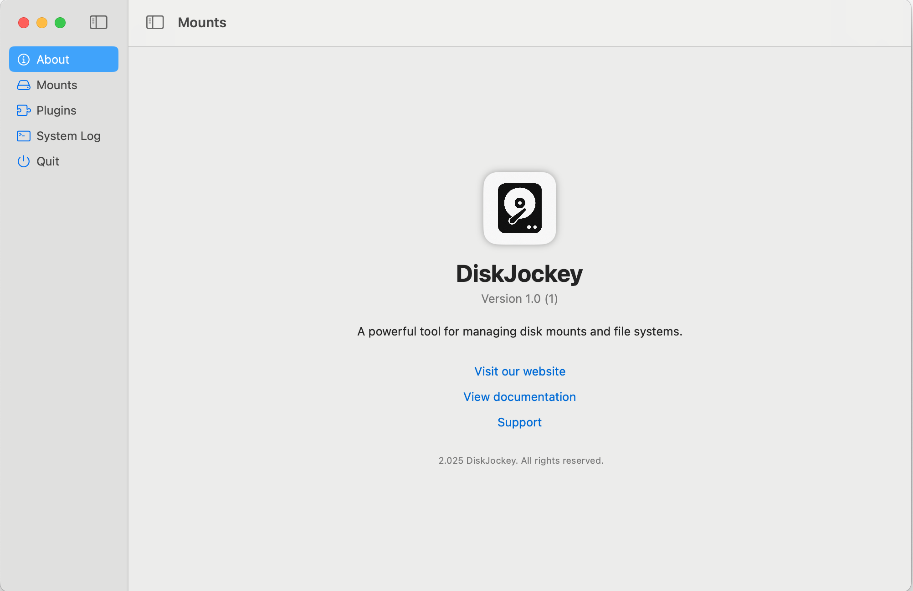

# DiskJockey



DiskJockey is a macOS application for mounting remote storage and disk images as native Finder volumes. It unifies three categories of filesystems — **network/cloud storage**, **block-device disk images**, and **local passthrough** — behind a consistent Finder experience. The block-device side is built on **FSKit** (macOS 15+) with pure-Rust filesystem drivers linked directly into per-filesystem extensions; the network side uses a **File Provider** extension backed by a Go networking library. Use it when you want ext4 / NTFS images and FTP / SFTP / SMB / WebDAV / S3 / Dropbox / Google Drive / OneDrive endpoints to look and behave like ordinary Finder volumes, without kernel extensions and without bundling third-party userspace tooling.

---

## Caveat

Because DiskJockey installs a File Provider extension and FSKit extensions, macOS requires the whole app bundle to be signed by a trusted Apple Developer identity. If you don't have an Apple Developer account, you can read the code but you can't run it end-to-end. Treat it as an educational reference in that case.

---

## Features

- **Native Finder volumes for ext2 / ext3 / ext4 disk images.** Pure-Rust driver, FSKit extension, read + write.
- **Native Finder volumes for NTFS disk images.** Pure-Rust driver, FSKit extension, mount + read + write.
- **Eight network / cloud filesystems** through a File Provider extension: FTP, SFTP, SMB, WebDAV, S3, Dropbox, Google Drive, OneDrive.
- **Local-directory passthrough** disk type for end-to-end testing of the File Provider stack.
- **CLI client (`djctl`)** that speaks the same protobuf API the GUI uses, for scripting and automation.
- **Per-mount tagged logging** with live in-app log views and per-partition log strips.
- **Per-mount I/O counters and throughput sparklines for every network driver** — HTTP-based drivers (Dropbox / Google Drive / OneDrive / WebDAV / S3) wrap their `http.Client`; socket-based drivers (FTP / SFTP / SMB) wrap the underlying `net.Conn`. FTPS counts ciphertext bytes (what the wire sees, not the plaintext). One unified `MountStats` snapshot shape across all eight.
- **Provider-native thumbnails for Dropbox, Google Drive, and OneDrive** — each driver hits the provider's thumbnail endpoint directly (Dropbox `get_thumbnail_v2`, GDrive `thumbnailLink` CDN, OneDrive `/items/{id}/thumbnails`); the source file is never downloaded. Thumbnails go through a SQLite cache so Finder's repeated asks for the same icon never re-fetch.
- **Browser-based OAuth sign-in** for Dropbox, Google Drive, and OneDrive.
- **Tabler icon set** wired through the sidebar and detail views; OS-flavoured glyphs for ext / NTFS attached disks.

## Supported filesystems at a glance

### Network / Cloud (via File Provider extension)

| Driver        | Auth                          | List | Read | Write | Delete | Rename |
|---------------|-------------------------------|:----:|:----:|:-----:|:------:|:------:|
| FTP           | username / password           | ✅   | ✅   | ✅    | ✅     | ✅     |
| SFTP          | password / SSH key            | ✅   | ✅   | ✅    | ✅     | ✅     |
| SMB           | username / password           | ✅   | ✅   | ✅    | ✅     | ✅     |
| WebDAV        | basic auth                    | ✅   | ✅   | ✅    | ✅     | ✅     |
| S3            | access key / secret           | ✅   | ✅   | ✅    | ✅     | ✅     |
| Dropbox       | OAuth2 (browser sign-in)      | ✅   | ✅   | ✅    | ✅     | ✅     |
| Google Drive  | OAuth2 (browser sign-in)      | ✅   | ✅   | ✅    | ✅     | ✅     |
| OneDrive      | OAuth2 PKCE (browser sign-in) | ✅   | ✅   | ✅    | ✅     | ✅     |

### Block-device disk images (via FSKit)

| Filesystem | Target            | Status |
|------------|-------------------|--------|
| ext2 / ext3 / ext4 | `DiskJockeyEXT4/` | Mount + read + write; clean unmount; fsck via callback ABI |
| NTFS               | `DiskJockeyNTFS/` | Mount + read + write; verify via `startCheck`; volumes round-trip with the canonical Windows tooling |

OAuth app-registration instructions for the cloud drivers are in [`docs/`](docs/):
- [Dropbox](docs/dropbox-registration.md)
- [Google Drive](docs/google-drive-registration.md)
- [Microsoft OneDrive](docs/microsoft-onedrive-registration.md)

---

## What works

Concrete, observable on a current build:

- **ext4 FSKit extension** mounts ext2/3/4 images as Finder volumes, lists directories, opens files, accepts writes, and reports superblock metadata (UUID, label, last-mount time, dirty flag) into the host app's detail view.
- **NTFS FSKit extension** mounts NTFS images, accepts writes, and exposes a verify (`startCheck`) flow with a confirmation dialog and read-only lock indicator. Volumes round-trip with the canonical Windows verify tooling.
- **All eight network drivers** verified end-to-end against their respective servers; writes flow through Finder for every scheme.
- **Sidebar surfaces unformatted disks** discovered via DiskArbitration, with cold-start persistence and stable identity across sessions.
- **Format actions** for raw disks route through FSKit `startFormat`, chained under a single admin auth prompt.
- **Per-mount I/O counters and sparklines** in the detail view for every one of the eight network drivers — HTTP transports counted via `CountingTransport`, socket transports via `CountingConn` at the dial layer.
- **Browser-based OAuth sign-in** for Dropbox, Google Drive, OneDrive — refresh tokens stored in Keychain.
- **Per-mount thumbnail cache** (SQLite) with a cellular-data gate and enumerator pre-warm.
- **CLI driver** (`djctl`): list mounts, list disk types, exercise the protobuf API headlessly.
- **Local-directory passthrough** for exercising the File Provider pipeline without a real network round trip.

## What doesn't work

Honest list of known gaps as of 2026-05-03:

- **Backend lifecycle.** Launching the Go daemon as a child of the XPC bridge fails under macOS Launch Constraint Violation. Workaround: install the Go binary as a manual user `LaunchAgent`. A notarised `SMAppService` registration is the proper fix and is outstanding.
- **Finder caching.** The system aggressively caches File Provider data. Current mitigation is `removeAllDomains` on startup — blunt. A targeted `signalEnumerator` strategy is the proper fix.
- **No batch / multi-select operations** through Finder yet for network mounts; single-item flows only.
- **No write-back conflict resolution UI** for cloud drivers — last-writer-wins, no merge prompts.
- **No background sync / offline file pinning** — items are streamed on demand.
- **No installer / notarised release.** Building from source with an Apple Developer account is the only path today.
- **UI redesign** — a full SwiftUI redesign of the desktop app is on the backlog; current UI is functional but unpolished in places.
- **Linux drive icon** uses a Tabler placeholder until a permissively-licensed Tux glyph is sourced.

---

## Tested

Test surface across the project:

- **`vendor/rust-fs-ext4`** — ~444 Rust test cases across the integration suite (`tests/*.rs`), including write-path crash-safety, sequence-advance, orphan recovery, ext3 RW, journal replay, and CI validation that round-trips formatted images through the Linux-side reference validator on every push.
- **`vendor/rust-fs-ntfs`** — ~395 Rust test cases, plus a data-driven matrix runner (`tests/matrix.rs` + `test-matrix.json`) that emits one trial per scenario and shells out to the platform's canonical validator on Windows runners. Mac-side mount + write smoke is the contract that gates the matrix.
- **`vendor/go-networkfs`** — per-driver Go test suites and a Docker Compose stack (`test-server/`) with FTP / SFTP / WebDAV / SMB endpoints for end-to-end driver tests.
- **DiskJockey host app** — Swift model + extension unit tests under `DiskJockey*Tests/` (mount config, log routing, FSKit shim translation).

The two Rust libraries together publish a stable C ABI (`fs_ext4_*`, `fs_ntfs_*`) and the FSKit extensions are thin Swift shims over those entry points; the test investment is concentrated in the libraries where the format complexity lives.

## Not tested

Gaps to know about before trusting this with real data:

- **No fuzzing of the FSKit shim layer** — only the underlying Rust libraries have fuzz harnesses.
- **No automated end-to-end test** that drives the full GUI → File Provider → network driver path; integration coverage stops at the protobuf boundary on each side.
- **No CI for the macOS app bundle itself** — only the vendored Rust + Go libraries have hosted CI. Xcode builds are local-only.
- **NTFS write coverage** is comprehensive at the format layer but light on adversarial cases (concurrent multi-writer, partial-power-loss simulation beyond what the matrix scenarios cover).
- **OAuth refresh-token expiry / re-auth flows** have not been exercised against month-long-stale tokens.
- **Cloud driver rate-limit handling** — no soak tests against Dropbox / Google Drive / OneDrive API throttling.

---

## Roadmap

### Mounting + lifecycle
- [ ] Auto-mount network volumes at login
- [ ] Notarised `SMAppService` daemon registration (replace the manual LaunchAgent workaround)
- [ ] Background sync + offline pinning for cloud drivers
- [ ] Targeted `signalEnumerator` cache invalidation (drop the `removeAllDomains` blunt-instrument)

### Filesystem coverage
- [ ] ext3 journal coverage parity with ext4 write path
- [ ] NTFS adversarial / power-loss test scenarios in the matrix runner
- [ ] APFS read-only image support (FSKit extension)
- [ ] FAT32 / exFAT image support

### Network drivers
- [ ] Additional cloud providers (Box, pCloud, iCloud Drive)
- [ ] Conflict-resolution UI for write-back races
- [ ] Per-driver rate-limit + retry policy surfaces in the GUI

### App polish
- [ ] Full SwiftUI redesign of the desktop app
- [ ] Installer / notarised release pipeline
- [ ] Permissively-licensed Linux/Tux glyph in the sidebar
- [ ] Localisation beyond the current strings table

### Tooling
- [ ] CI for the macOS app bundle (Xcode build + extension smoke)
- [ ] `THIRD_PARTY_LICENSES.md` generated from `cargo about` + `go-licenses`

---

## Changelog

Reverse-chronological. Pulled from `git log`, breakthroughs highlighted.

### 2026-05-03
- **I/O stats on every network driver.** FTP / SFTP / SMB now instrument the underlying `net.Conn` at dial time (FTPS counts ciphertext bytes, what the wire actually carries). WebDAV + S3 wrap their `http.Client` with the existing `CountingTransport`. Every driver implements `StatsProvider`; `networkfs_get_stats(mount_id)` returns real numbers across the board instead of zeros for five of eight drivers.
- **Native thumbnails for Google Drive and OneDrive.** GDrive uses the file metadata's `thumbnailLink` CDN URL with `=s<px>` size-rewriting; OneDrive uses `GET /items/{id}/thumbnails` to pick the right pre-rendered bucket. Neither downloads the source file. FTP / SFTP / SMB / WebDAV / S3 stay truthful (no native thumbnail API → no `Thumbnailer` impl → driver returns rc=2 → Finder falls back to a generic icon). Future client-side thumbnail generator will populate the same SQLite cache from already-downloaded file bytes, so those protocols can still get thumbnails opportunistically without lying about protocol capabilities.
- Submodule bumps for rust-fs-ntfs (verbose mode wired through to remote, live verbose output refactor, observability + safety contracts, bench harness + OOM fix, FUTURE_FEATURES fixes, /scan-13 docs, Tier 3 fixture dispatcher, CLI consolidation + release infra).
- Submodule bumps for rust-fs-ext4 (close all crash-safety test gaps, sequence-advance + orphan-crash tests, Phase 5.2 finish, cross-validator infra, **ext3 RW unlock — Phase B complete**, write path Phases 1/2/3/5/6/7/8).

### 2026-05-02
- **NTFS mount breakthrough** — rust-fs-ntfs volumes mount and accept writes round-tripped with Windows tooling, after switching the test contract from validator-clean to mount + write smoke.

### 2026-05-01
- Stats: pull transport byte counts from the network library each tick.
- Mount: chain `mkdir` + mount under one admin auth prompt.
- Disks: skip whole-disk preview rows so Forget sticks; offline-row Mount via DiskArbitration.
- Thumbnails: SQLite cache, cellular gate, enumerator pre-warm.
- Mount: per-mount `MountPolicy` with thumbnail toggles.
- **FileProvider: write support across all eight schemes.**
- **OAuth: browser sign-in for Dropbox, Google Drive, OneDrive.**
- UI: two-column Volume info layout; brand glyphs for FTP / SMB / Dropbox / Google Drive; sidebar-toggle in titlebar.
- Format: switch from `newfs_fskit` to `diskutil eraseDisk/eraseVolume`; wire Format buttons to FSKit `startFormat`.
- Disks: `RawDisksModel` + Unformatted Disks sidebar + format scaffolding; persist disk history to JSON in App Group.
- FSKit: pure `runFsck()` with shared `FsckReport` shape; full RW write path + AppleDouble swallow; explicit verify via `startCheck`.
- Stats: per-mount I/O counters + sparkline UI.
- Logging: scope tags + per-view denylists.
- Docs: IP & licence audit landed.

### 2026-04-22
- Release 1.0.1 — vendor refresh + extension version alignment.
- UI: OS-flavoured icons for ext\* / ntfs\* attached disks.

### 2026-04-21
- UI: rename "Attached Disks" → "Local Drives", add Unmount button.
- `dev.sh`: doctor subcommand, clean-stale-bundles, reset-daemons, pluginkit-reload.
- FileProvider: classified `networkfs_mount` errors surfaced to UI.

### 2026-04-20
- **Direct-link architecture** — removed standalone backend daemon + XPC bridge in favour of linking the network library directly into the FileProvider extension via cgo.
- Cloud-provider OAuth registration guides.
- Sandbox + symlinks: user-picked folder via `NSOpenPanel` bookmark.
- FileProvider: direct-linked FTP driver end-to-end; mount/unmount toggle + live status; classified metadata failures.
- Logging + sidebar: route through `AppLog`, status dot, unstick "Loading".
- Modernised `Makefile`; renamed `NFS_*` → `NETWORKFS_*`.
- Per-mount `TaggedLogger` end-to-end; newest-first log ordering.

### 2025-06-21
- **Mounts working end-to-end.** Selecting a mount toggles a Finder sidebar volume; communication channel between the Mac app and the File Provider extension live.

### 2025-05-20 → 2025-06-14
- Backend split into a server; localisation; TCP socket locking; system log view; first File Provider with real Finder volumes.
- Realised the project requires an Apple Developer account to launch File Provider extensions.

### 2025-06-12
- Concluded the helper-app-mediated IPC architecture wouldn't work — superseded by the LaunchAgent XPC bridge, which itself was later superseded by the direct-link architecture (2026-04-20).

---

## Architecture

DiskJockey is multi-process by design. Each process has one job, and process boundaries are the trust / lifecycle boundaries.

```
                        ┌────────────────────┐
                        │  DiskJockey.app    │    SwiftUI config UI.
                        │  (GUI, optional)   │    NOT required at runtime.
                        └──────────┬─────────┘
                                   │ XPC
                                   ▼
  ┌─────────────────────┐    ┌──────────────────────┐
  │  File Provider Ext  │◄──►│   XPC Bridge         │    Network drivers linked
  │  (per-network-mount)│XPC │   (LaunchAgent,      │    directly into the File
  │  links libnetworkfs │    │    mach service)     │    Provider extension via
  └─────────────────────┘    └──────────────────────┘    cgo.
                                       ▲
                                       │ XPC
                             ┌─────────┴──────────┐
                             │  djctl CLI         │
                             │  (scripting)       │
                             └────────────────────┘

  ┌─────────────────────────┐    ┌─────────────────────────┐
  │  DiskJockeyEXT4 (FSKit) │    │  DiskJockeyNTFS (FSKit) │
  │  links libfs_ext4.a     │    │  links libfs_ntfs.a     │
  └─────────────────────────┘    └─────────────────────────┘
            (independent — direct block-device access via FSKit)
```

### Components

- **DiskJockeyApplication** — SwiftUI macOS GUI for configuring mounts. Optional at runtime.
- **DiskJockeyXPC** — Small executable installed as a LaunchAgent with a mach service (`com.antimatterstudios.diskjockey.xpc-bridge`); the central IPC hub. Every other Swift component connects to it as an XPC client. macOS XPC restricts cross-bundle service discovery, and a LaunchAgent with a registered mach service is the only reliable path.
- **DiskJockeyFileProvider** — File Provider extension presenting network filesystems in Finder. Links the network library (`libnetworkfs.a`) directly via cgo; per-driver static libs are also linked (`libftp.a`, `libsftp.a`, …) and the extension dispatches by driver type.
- **DiskJockeyLibrary** — Swift framework shared by the app, extension, XPC bridge, and CLI. Holds generated protobuf, mount-config value types, keychain helpers, logging, and the File Provider XPC protocol.
- **DiskJockeyEXT4 / DiskJockeyNTFS** — FSKit extensions (macOS 15+). Each links a Rust library (`libfs_ext4.a` or `libfs_ntfs.a`) as an XCFramework through a bridging header and serves block-device reads + writes directly. Independent of the network stack.
- **diskjockey-cli (`djctl`)** — Command-line client for the same protobuf API the GUI uses.

### Why a separate FSKit path for ext4 / NTFS?

Block-device filesystems don't benefit from a server-in-the-middle: all bytes come from a local file or local block device. Sending those bytes across a socket to a separate process and back is pure overhead. FSKit is Apple's sanctioned way to implement a filesystem in user space and link native parsing code directly. The Rust libraries do the format work; the Swift FSKit target is a thin shim over `FSVolume` / `FSItem`.

---

## Project layout

```
.
├── DiskJockey.xcodeproj/
├── DiskJockeyApplication/        # SwiftUI GUI app
├── DiskJockeyFileProvider/       # File Provider extension (network mounts)
├── DiskJockeyEXT4/               # FSKit extension for ext2/3/4 images
├── DiskJockeyNTFS/                # FSKit extension for NTFS
├── DiskJockeyXPC/                # LaunchAgent XPC bridge
├── DiskJockeyMountHelper/        # Privileged helper for admin-prompt mount/format
├── DiskJockeyLibrary/            # Shared Swift framework
│   ├── Models/
│   ├── NetworkFS/                # Per-driver MountConfig structs + keychain
│   ├── FileProvider/             # XPC protocol definitions
│   └── Protobuf/                 # .proto sources + generated Swift
├── diskjockey-cli/               # djctl CLI client
├── docs/                         # End-user + developer docs
├── scripts/                      # Build helpers
├── lib/                          # Pre-built vendored artefacts
│   ├── fs_ext4/                  # fs_ext4.xcframework
│   ├── fs_ntfs/                   # fs_ntfs.xcframework
│   └── go-networkfs/             # libnetworkfs.a + per-driver static libs
└── vendor/                       # git submodules — source of truth for lib/
    ├── rust-fs-ext4/
    ├── rust-fs-ntfs/
    ├── go-networkfs/
    └── tabler-icons/
```

---

## License

MIT — see [`LICENSE`](LICENSE). Copyright (c) 2025 Christopher Thomas.

For a full audit of every dependency licence and the verdict that the MIT licence is not at risk of being forced into a stricter copyleft licence, see [`docs/intellectual-property-review.md`](docs/intellectual-property-review.md).

Vendored submodules: `rust-fs-ext4` (MIT), `rust-fs-ntfs` (MIT OR Apache-2.0), `go-networkfs` (MIT), `tabler-icons` (MIT — Paweł Kuna).

---

## Build

### Prerequisites

- **macOS 15 (Sequoia) or later** — FSKit requires it
- **Xcode 16+**
- **Go 1.25+**
- **Rust toolchain** (current stable; the Rust crates pin via `rust-toolchain.toml`)
- **`protoc`** with `protoc-gen-go` and `protoc-gen-swift`
- **Apple Developer account** (for code signing — required to run the File Provider and FSKit extensions)
- Optional: **Docker** for the network-driver test stack under `vendor/go-networkfs/test-server/`

### One-time setup

```bash
git clone https://github.com/christhomas/diskjockey.git
cd diskjockey
git submodule update --init --recursive
```

### Build the vendored libraries

```bash
make vendor-all
```

This runs:

1. `vendor-fs-ext4` — builds the Rust ext4 library into an XCFramework at `lib/fs_ext4/`.
2. `vendor-fs-ntfs` — same for NTFS, into `lib/fs_ntfs/`.
3. `vendor-gonetworkfs` — builds per-driver Go static libs (`libftp.a`, `libsftp.a`, …) plus the combined `libnetworkfs.a` dispatcher into `lib/go-networkfs/`.

Then regenerate protobuf bindings (one-shot, regenerate after `.proto` changes):

```bash
make proto
```

`make all` chains `vendor-all` + `proto`.

### Build the app + extensions

```bash
xcodebuild -scheme DiskJockey -allowProvisioningUpdates build
```

A Run Script phase invokes `bash -lc "which go"` and rebuilds the network library on each Xcode build. **User Script Sandboxing must be off** for the target — the script needs Keychain access during signing.

### Build + run the CLI

```bash
go build -o djctl ./diskjockey-cli
./djctl list-mounts
./djctl list-disktypes
```

### Test stack for network drivers

```bash
cd vendor/go-networkfs/test-server
docker compose up
# SFTP   → localhost:2223
# FTP    → localhost:2121
# WebDAV → localhost:8080
# SMB    → localhost:4450
```

### Vendor pin discipline

After bumping any submodule, regenerate the human-readable pin manifest:

```bash
make pins
```

`VENDOR_PINS.txt` is committed alongside the submodule bump. `make pins-check` fails if it's stale — wire into CI when CI exists for this repo.
